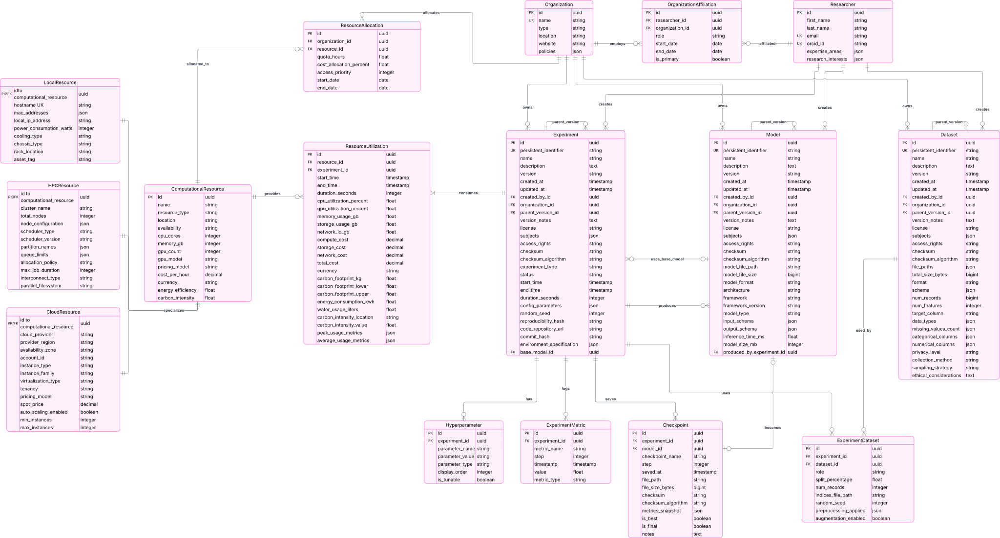

# Logical Data Model

## Introduction

This document provides detailed specifications for all entities in the OpenModelsHub data model. It defines attributes, data types, constraints, relationships, and enumerations.

## Entity-Relationship Diagram

## MLAsset Hierarchy

All ML assets inherit from a common `MLAsset` base class that provides shared functionality for identification, metadata, and versioning.

### MLAsset (Abstract)

The foundation class for all ML assets, providing common properties and behaviors.

#### Core Attributes

| Category | Attribute | Type | Description | Constraints |
|----------|-----------|------|-------------|-------------|
| **Identity** | id | UUID | System-generated unique identifier | Primary Key, Not Null |
| | persistent_identifier | String(255) | External persistent ID (DOI, ARK, etc.) | Unique, Not Null |
| **Basic Info** | name | String(255) | Human-readable asset name | Not Null, Indexed |
| | description | Text | Detailed description | Not Null |
| | version | String(50) | Version identifier (e.g., "v2.1.0") | Not Null |
| **Timestamps** | created_at | DateTime | Creation timestamp | Not Null, Auto, Indexed |
| | updated_at | DateTime | Last modification timestamp | Not Null, Auto |
| **Ownership** | created_by | → Researcher | Asset creator | Foreign Key, Not Null |
| | organization | → Organization | Owning institution | Foreign Key, Not Null |
| **Versioning** | parent_version | → MLAsset (self) | Parent version in lineage | Foreign Key, Nullable |
| | version_notes | Text | Description of version changes | Nullable |
| **Metadata** | license | String(100) | Usage license (SPDX identifier) | Not Null |
| | subjects | JSON Array | Classification keywords and topics | Default: [] |
| | access_rights | Enum | Access level | Not Null, See ACCESS_RIGHTS_ENUM |
| **Integrity** | checksum | String(128) | File integrity hash | Not Null |
| | checksum_algorithm | Enum | Hash algorithm used | Not Null, See CHECKSUM_ALGORITHM_ENUM |

#### ACCESS_RIGHTS_ENUM
- `PUBLIC`: Openly accessible to all users
- `REGISTERED`: Requires user authentication
- `RESTRICTED`: Requires special permissions
- `EMBARGOED`: Time-limited access restriction

#### CHECKSUM_ALGORITHM_ENUM
- `MD5`: MD5 hash (legacy, not recommended)
- `SHA1`: SHA-1 hash (legacy, not recommended)
- `SHA256`: SHA-256 hash (recommended)
- `SHA512`: SHA-512 hash (high security)

#### Relationships

| Relationship Name | Target Entity | Cardinality | Description |
|-------------------|---------------|-------------|-------------|
| parent_version | MLAsset (self) | 0..1 | Parent version in lineage chain (optional) |
| created_by | Researcher | 1..M | Asset creator (required) |
| owned_by | Organization | 1..1 | Owning institution (required) |

---

### Model

Represents a trained machine learning model with performance metrics and deployment information.

#### Model-Specific Attributes

| Category | Attribute | Type | Description | Constraints |
|----------|-----------|------|-------------|-------------|
| **File Info** | model_file_path | String(500) | Location of model file | Not Null |
| | model_file_size | BigInteger | Size in bytes | Not Null, > 0 |
| | model_format | Enum | File format | Not Null, See MODEL_FORMAT_ENUM |
| **Architecture** | architecture | Text | Model architecture description | Not Null |
| | framework | Enum | ML framework | Not Null, See FRAMEWORK_ENUM |
| | framework_version | String(20) | Framework version | Not Null |
| | model_type | Enum | ML task type | Not Null, See MODEL_TYPE_ENUM |
| **Schema** | input_schema | JSON | Expected input format specification | Nullable |
| | output_schema | JSON | Output format specification | Nullable |
| **Performance** | inference_time_ms | Float | Average prediction time (milliseconds) | Nullable, ≥ 0 |
| | model_size_mb | Float | Model memory footprint (megabytes) | Nullable, ≥ 0 |

#### MODEL_FORMAT_ENUM
- `PYTORCH`: PyTorch .pt or .pth file
- `TENSORFLOW_SAVEDMODEL`: TensorFlow SavedModel format
- `TENSORFLOW_H5`: TensorFlow HDF5 format
- `ONNX`: Open Neural Network Exchange format
- `KERAS`: Keras model format
- `SCIKIT_LEARN`: Scikit-learn pickle format
- `XGBOOST`: XGBoost model format
- `LIGHTGBM`: LightGBM model format
- `OTHER`: Other format (specify in description)

#### FRAMEWORK_ENUM
- `PYTORCH`: PyTorch
- `TENSORFLOW`: TensorFlow
- `KERAS`: Keras
- `SCIKIT_LEARN`: Scikit-learn
- `JAX`: JAX
- `MXNET`: Apache MXNet
- `XGBOOST`: XGBoost
- `LIGHTGBM`: LightGBM
- `CATBOOST`: CatBoost
- `HUGGINGFACE`: Hugging Face Transformers
- `OTHER`: Other framework

#### MODEL_TYPE_ENUM
- `CLASSIFICATION`: Classification task
- `REGRESSION`: Regression task
- `CLUSTERING`: Clustering task
- `GENERATION`: Generative task
- `TRANSLATION`: Translation task
- `SUMMARIZATION`: Summarization task
- `QUESTION_ANSWERING`: Question answering
- `OBJECT_DETECTION`: Object detection
- `IMAGE_SEGMENTATION`: Image segmentation
- `SPEECH_RECOGNITION`: Speech recognition
- `REINFORCEMENT_LEARNING`: Reinforcement learning
- `OTHER`: Other task type

#### Relationships

**Inherits from:** MLAsset (all base attributes and relationships)

| Relationship Name | Target Entity | Cardinality | Description |
|-------------------|---------------|-------------|-------------|
| produced_by | Experiment | 1..1 | Experiment that created this model |
| base_model_for | Experiment | 0..M | Experiments using this as base model |
| checkpoints | Checkpoint | 0..1 | Checkpoints promoted to this model |

---

### Dataset

Represents a collection of data used for ML training, validation, or testing.

#### Dataset-Specific Attributes

| Category | Attribute | Type | Description | Constraints |
|----------|-----------|------|-------------|-------------|
| **File Info** | file_paths | JSON Array | List of dataset file locations | Not Null, Default: [] |
| | total_size_bytes | BigInteger | Combined size of all files | Not Null, > 0 |
| | format | Enum | Primary data format | Not Null, See DATASET_FORMAT_ENUM |
| **Structure** | schema | JSON | Data structure definition | Nullable |
| | num_records | BigInteger | Total number of data points | Nullable, ≥ 0 |
| | num_features | Integer | Number of input columns | Nullable, ≥ 0 |
| | target_column | String(100) | Column with labels/outcomes | Nullable |
| **Data Analysis** | data_types | JSON Object | Column type mapping {col: type} | Default: {} |
| | missing_values_count | JSON Object | Missing data per column {col: count} | Default: {} |
| | categorical_columns | JSON Array | Non-numeric classification columns | Default: [] |
| | numerical_columns | JSON Array | Numeric data columns | Default: [] |
| **Privacy** | privacy_level | Enum | Data sensitivity | Not Null, See PRIVACY_LEVEL_ENUM |
| | ethical_considerations | Text | Bias, fairness, and ethical notes | Nullable |
| **Collection** | collection_method | String(255) | How data was gathered | Nullable |
| | sampling_strategy | String(255) | Data sampling approach | Nullable |

#### DATASET_FORMAT_ENUM
- `CSV`: Comma-separated values
- `JSON`: JSON format
- `JSONL`: JSON Lines format
- `PARQUET`: Apache Parquet format
- `HDF5`: Hierarchical Data Format 5
- `ARROW`: Apache Arrow format
- `AVRO`: Apache Avro format
- `TFRecord`: TensorFlow Record format
- `PICKLE`: Python pickle format
- `NPY`: NumPy array format
- `IMAGE_FOLDER`: Directory of images
- `TEXT_FILES`: Collection of text files
- `AUDIO_FILES`: Collection of audio files
- `OTHER`: Other format

#### PRIVACY_LEVEL_ENUM
- `PUBLIC`: Publicly available data
- `INTERNAL`: Internal use only
- `CONFIDENTIAL`: Confidential data with restrictions
- `RESTRICTED`: Highly restricted access
- `ANONYMIZED`: Anonymized/de-identified data

#### Relationships

**Inherits from:** MLAsset (all base attributes and relationships)

| Relationship Name | Target Entity | Cardinality | Description |
|-------------------|---------------|-------------|-------------|
| experiment_usages | ExperimentDataset | 0..M | Usage in experiments (via association) |

---

### Experiment

Represents a complete ML training or evaluation run with full reproducibility information.

#### Experiment-Specific Attributes

| Category | Attribute | Type | Description | Constraints |
|----------|-----------|------|-------------|-------------|
| **Classification** | experiment_type | Enum | Purpose | Not Null, See EXPERIMENT_TYPE_ENUM |
| | status | Enum | Execution state | Not Null, See EXPERIMENT_STATUS_ENUM |
| **Timing** | start_time | DateTime | When experiment began | Nullable, Indexed |
| | end_time | DateTime | When experiment finished | Nullable |
| | duration_seconds | Integer | Total execution time | Nullable, ≥ 0 |
| **Configuration** | config_parameters | JSON Object | General experiment settings | Default: {} |
| | random_seed | Integer | Reproducibility seed value | Nullable |
| | reproducibility_hash | String(64) | Unique fingerprint for reproduction | Nullable |
| **Code & Environment** | code_repository_url | URL | Link to source code | Nullable |
| | code_commit_hash | String(40) | Exact code version used (Git SHA) | Nullable |
| | environment_specification | JSON Object | Software dependencies and versions | Default: {} |

#### EXPERIMENT_TYPE_ENUM
- `TRAINING`: Model training
- `VALIDATION`: Model validation
- `TESTING`: Model testing/evaluation
- `HYPERPARAMETER_TUNING`: Hyperparameter optimization
- `FINE_TUNING`: Fine-tuning existing model
- `TRANSFER_LEARNING`: Transfer learning
- `BENCHMARK`: Benchmark evaluation
- `OTHER`: Other experiment type

#### EXPERIMENT_STATUS_ENUM
- `PENDING`: Not yet started
- `RUNNING`: Currently executing
- `COMPLETED`: Successfully finished
- `FAILED`: Failed with errors
- `CANCELLED`: Manually cancelled
- `PAUSED`: Temporarily paused

#### Relationships

**Inherits from:** MLAsset (all base attributes and relationships)

| Relationship Name | Target Entity | Cardinality | Description |
|-------------------|---------------|-------------|-------------|
| base_model | Model | 0..1 | Base model for fine-tuning or transfer learning (optional) |
| produced_models | Model | 0..M | Models produced by this experiment |
| dataset_usages | ExperimentDataset | 1..M | Datasets used (via association) - at least one required |
| hyperparameters | Hyperparameter | 1..M | Configuration parameters |
| metrics | ExperimentMetric | 1..M | Time-series metrics logged |
| checkpoints | Checkpoint | 0..M | Training checkpoints saved |
| resource_utilizations | ResourceUtilization | 1..M | Resource usage records |

---

## Experiment Support Entities

### Hyperparameter

Stores individual experiment configuration parameters for efficient querying.

#### Core Attributes

| Category | Attribute | Type | Description | Constraints |
|----------|-----------|------|-------------|-------------|
| **Identity** | id | UUID | System-generated unique identifier | Primary Key, Not Null |
| **Association** | experiment | → Experiment | Owning experiment | Foreign Key, Not Null |
| **Parameter** | parameter_name | String(100) | Parameter name | Not Null, Indexed |
| | parameter_value | String(500) | Parameter value (as string) | Not Null |
| | parameter_type | Enum | Data type | Not Null, See PARAMETER_TYPE_ENUM |
| **Display** | display_order | Integer | UI presentation order | Default: 0 |
| | is_tunable | Boolean | If part of hyperparameter search | Default: False |

#### PARAMETER_TYPE_ENUM
- `FLOAT`: Floating-point number
- `INTEGER`: Integer number
- `STRING`: String value
- `BOOLEAN`: Boolean value
- `LIST`: List/array of values
- `DICT`: Dictionary/object

#### Unique Constraints
- (experiment, parameter_name)

#### Relationships

| Relationship Name | Target Entity | Cardinality | Description |
|-------------------|---------------|-------------|-------------|
| experiment | Experiment | 1..1 | Owning experiment (required) |

---

### ExperimentMetric

Tracks time-series metrics logged during training (loss, accuracy, etc.).

#### Core Attributes

| Category | Attribute | Type | Description | Constraints |
|----------|-----------|------|-------------|-------------|
| **Identity** | id | UUID | System-generated unique identifier | Primary Key, Not Null |
| **Association** | experiment | → Experiment | Owning experiment | Foreign Key, Not Null |
| **Metric** | metric_name | String(100) | Metric identifier | Not Null, Indexed |
| | step | Integer | Epoch or training step | Not Null, ≥ 0 |
| | timestamp | DateTime | When metric was recorded | Not Null, Auto |
| | value | Float | Metric value | Not Null |
| **Classification** | metric_type | Enum | Type of metric | Not Null, See METRIC_TYPE_ENUM |

#### METRIC_TYPE_ENUM
- `LOSS`: Loss function value
- `ACCURACY`: Accuracy metric
- `PRECISION`: Precision metric
- `RECALL`: Recall metric
- `F1`: F1 score
- `AUC`: Area under curve
- `MAE`: Mean absolute error
- `MSE`: Mean squared error
- `RMSE`: Root mean squared error
- `R2`: R-squared score
- `PERPLEXITY`: Perplexity (language models)
- `BLEU`: BLEU score (translation)
- `CUSTOM`: Custom metric

#### Unique Constraints
- (experiment, metric_name, step)

#### Relationships

| Relationship Name | Target Entity | Cardinality | Description |
|-------------------|---------------|-------------|-------------|
| experiment | Experiment | 1..1 | Owning experiment (required) |

---

### Checkpoint

Represents saved model states during training for resume and rollback.

#### Core Attributes

| Category | Attribute | Type | Description | Constraints |
|----------|-----------|------|-------------|-------------|
| **Identity** | id | UUID | System-generated unique identifier | Primary Key, Not Null |
| **Association** | experiment | → Experiment | Owning experiment | Foreign Key, Not Null |
| | model | → Model | If checkpoint becomes published model | Foreign Key, Nullable |
| **Identification** | checkpoint_name | String(100) | Checkpoint identifier | Not Null |
| | step | Integer | Epoch or training step | Not Null, ≥ 0 |
| | saved_at | DateTime | When checkpoint was saved | Not Null, Auto |
| **File** | file_path | String(500) | Location of checkpoint file | Not Null |
| | file_size_bytes | BigInteger | Checkpoint file size | Not Null, > 0 |
| | checksum | String(128) | File integrity hash | Not Null |
| | checksum_algorithm | Enum | Hash algorithm | Not Null, See CHECKSUM_ALGORITHM_ENUM |
| **Metadata** | metrics_snapshot | JSON Object | Metrics at this checkpoint | Default: {} |
| | is_best | Boolean | Best checkpoint based on metric | Default: False, Indexed |
| | is_final | Boolean | Final checkpoint (training complete) | Default: False |
| | notes | Text | Additional notes | Nullable |

#### Relationships

| Relationship Name | Target Entity | Cardinality | Description |
|-------------------|---------------|-------------|-------------|
| experiment | Experiment | 1..1 | Owning experiment (required) |
| model | Model | 0..1 | Published model (if checkpoint promoted) |

---

## Resource Management

### ComputationalResource (Base)

Represents computing infrastructure used for ML training and inference. This is the base class for specialized resource types.

#### Core Attributes

| Category | Attribute | Type | Description | Constraints |
|----------|-----------|------|-------------|-------------|
| **Identity** | id | UUID | System-generated unique identifier | Primary Key, Not Null |
| | name | String(255) | Human-readable resource name | Not Null |
| | resource_type | Enum | Type of resource | Not Null, See RESOURCE_TYPE_ENUM |
| | location | String(255) | Physical or logical location | Not Null |
| | availability | Enum | Current status | Not Null, See AVAILABILITY_ENUM |
| **CPU** | cpu_cores | Integer | Number of CPU cores | Not Null, > 0 |
| **Memory** | memory_gb | Integer | Total system memory (GB) | Not Null, > 0 |
| **GPU** | gpu_count | Integer | Number of GPU devices | Default: 0, ≥ 0 |
| | gpu_model | String(100) | GPU model name | Nullable |
| **Cost** | pricing_model | String(50) | How costs are calculated | Not Null |
| | cost_per_hour | Decimal(10,4) | Hourly usage cost | Not Null, ≥ 0 |
| | currency | String(3) | Currency code (ISO 4217) | Default: 'USD' |
| **Environmental** | energy_efficiency | Float | Power usage effectiveness (0-1) | Nullable, 0-1 |
| | carbon_intensity | Float | kg CO2 per kWh | Nullable, ≥ 0 |

#### RESOURCE_TYPE_ENUM
- `LOCAL`: On-premises hardware
- `CLOUD`: Cloud provider instance
- `HPC`: High-performance computing cluster

#### AVAILABILITY_ENUM
- `AVAILABLE`: Resource is available
- `BUSY`: Resource is in use
- `MAINTENANCE`: Under maintenance
- `OFFLINE`: Offline/unavailable

#### Relationships

**Specialized as:** LocalResource, CloudResource, or HPCResource (inheritance)

| Relationship Name | Target Entity | Cardinality | Description |
|-------------------|---------------|-------------|-------------|
| allocations | ResourceAllocation | 0..M | Organization allocations (via association) |
| utilizations | ResourceUtilization | 0..M | Usage records by experiments |

---

### LocalResource

On-premises hardware resources (workstations, servers, local clusters).

**Inherits from:** ComputationalResource

#### Additional Attributes

| Category | Attribute | Type | Description | Constraints |
|----------|-----------|------|-------------|-------------|
| **Network** | hostname | String(255) | Network hostname | Not Null, Unique |
| | mac_addresses | JSON Array | Network interface MAC addresses | Default: [] |
| | local_ip_address | IP Address | Local network IP | Nullable |
| **Physical** | power_consumption_watts | Integer | Typical power consumption | Nullable, > 0 |
| | cooling_type | Enum | Cooling method | Not Null, See COOLING_TYPE_ENUM |
| | chassis_type | Enum | Physical form factor | Not Null, See CHASSIS_TYPE_ENUM |
| | rack_location | String(100) | Physical rack position | Nullable |
| | asset_tag | String(50) | Organizational asset ID | Nullable |

#### COOLING_TYPE_ENUM
- `AIR`: Air cooling
- `LIQUID`: Liquid cooling
- `PASSIVE`: Passive cooling
- `HYBRID`: Hybrid cooling

#### CHASSIS_TYPE_ENUM
- `DESKTOP`: Desktop workstation
- `TOWER`: Tower server
- `RACK`: Rack-mounted server
- `BLADE`: Blade server

---

### CloudResource

Virtual resources provided by cloud service providers.

**Inherits from:** ComputationalResource

#### Additional Attributes

| Category | Attribute | Type | Description | Constraints |
|----------|-----------|------|-------------|-------------|
| **Provider** | cloud_provider | Enum | Cloud provider | Not Null, See CLOUD_PROVIDER_ENUM |
| | provider_region | String(50) | Geographic region | Not Null |
| | availability_zone | String(50) | Specific AZ | Nullable |
| | account_id | String(100) | Cloud account ID | Nullable |
| **Instance** | instance_type | String(100) | Provider instance type | Not Null |
| | instance_family | String(50) | Instance category | Not Null |
| | virtualization_type | Enum | Virtualization tech | Not Null, See VIRTUALIZATION_TYPE_ENUM |
| | tenancy | Enum | Tenancy model | Not Null, See TENANCY_ENUM |
| **Pricing** | pricing_model | Enum | Pricing strategy | Not Null, See CLOUD_PRICING_ENUM |
| | spot_price | Decimal(10,4) | Spot instance price | Nullable, ≥ 0 |
| **Scaling** | auto_scaling_enabled | Boolean | Auto-scaling active | Default: False |
| | min_instances | Integer | Min instance count | Default: 1, > 0 |
| | max_instances | Integer | Max instance count | Default: 1, > 0 |

#### CLOUD_PROVIDER_ENUM
- `AWS`: Amazon Web Services
- `AZURE`: Microsoft Azure
- `GCP`: Google Cloud Platform
- `IBM_CLOUD`: IBM Cloud
- `ORACLE_CLOUD`: Oracle Cloud
- `ALIBABA_CLOUD`: Alibaba Cloud
- `DIGITALOCEAN`: DigitalOcean
- `OTHER`: Other provider

#### VIRTUALIZATION_TYPE_ENUM
- `HVM`: Hardware Virtual Machine
- `PV`: Paravirtual
- `CONTAINER`: Container-based

#### TENANCY_ENUM
- `SHARED`: Shared infrastructure
- `DEDICATED`: Dedicated instance
- `HOST`: Dedicated host

#### CLOUD_PRICING_ENUM
- `ON_DEMAND`: On-demand pricing
- `RESERVED`: Reserved instance
- `SPOT`: Spot/preemptible instance
- `SAVINGS_PLAN`: Savings plan

---

### HPCResource

High-performance computing cluster resources with job scheduling.

**Inherits from:** ComputationalResource

#### Additional Attributes

| Category | Attribute | Type | Description | Constraints |
|----------|-----------|------|-------------|-------------|
| **Cluster** | cluster_name | String(100) | HPC cluster identifier | Not Null |
| | total_nodes | Integer | Total compute nodes | Not Null, > 0 |
| | node_configuration | JSON Object | Per-node specs | Default: {} |
| **Scheduler** | scheduler_type | Enum | Job scheduler | Not Null, See SCHEDULER_TYPE_ENUM |
| | scheduler_version | String(50) | Scheduler version | Not Null |
| | partition_names | JSON Array | Available partitions | Default: [] |
| | queue_limits | JSON Object | Per-queue limits | Default: {} |
| **Policy** | allocation_policy | Enum | Node allocation | Not Null, See ALLOCATION_POLICY_ENUM |
| | max_job_duration | Integer | Max runtime (hours) | Not Null, > 0 |
| **Interconnect** | interconnect_type | Enum | Network type | Not Null, See INTERCONNECT_TYPE_ENUM |
| | parallel_filesystem | Enum | Shared filesystem | Not Null, See PARALLEL_FS_ENUM |

#### SCHEDULER_TYPE_ENUM
- `SLURM`: Slurm Workload Manager
- `PBS`: Portable Batch System
- `LSF`: IBM Spectrum LSF
- `SGE`: Sun Grid Engine
- `TORQUE`: TORQUE Resource Manager

#### ALLOCATION_POLICY_ENUM
- `EXCLUSIVE`: Exclusive node allocation
- `SHARED`: Shared node allocation

#### INTERCONNECT_TYPE_ENUM
- `INFINIBAND`: InfiniBand
- `ETHERNET`: Ethernet
- `OMNI_PATH`: Intel Omni-Path
- `PROPRIETARY`: Proprietary interconnect

#### PARALLEL_FS_ENUM
- `LUSTRE`: Lustre filesystem
- `GPFS`: IBM GPFS (Spectrum Scale)
- `BEEGFS`: BeeGFS
- `NFS`: Network File System
- `CEPH`: Ceph filesystem

---

### ResourceUtilization

Tracks actual consumption of computing resources during experiments, including integrated cost and environmental impact.

#### Core Attributes

| Category | Attribute | Type | Description | Constraints |
|----------|-----------|------|-------------|-------------|
| **Identity** | id | UUID | System-generated unique identifier | Primary Key, Not Null |
| **Association** | resource | → ComputationalResource | Which resource was used | Foreign Key, Not Null |
| | experiment | → Experiment | Which experiment | Foreign Key, Not Null |
| **Timing** | start_time | DateTime | When usage began | Not Null, Indexed |
| | end_time | DateTime | When usage ended | Nullable |
| | duration_seconds | Integer | Total usage time | Nullable, ≥ 0 |
| **Usage** | cpu_utilization_percent | Float | Average CPU usage | Not Null, 0-100 |
| | gpu_utilization_percent | Float | Average GPU usage | Nullable, 0-100 |
| | memory_usage_gb | Float | Peak memory consumption | Not Null, ≥ 0 |
| | storage_usage_gb | Float | Disk space consumed | Not Null, ≥ 0 |
| | network_io_gb | Float | Data transfer volume | Default: 0.0, ≥ 0 |
| **Cost** | compute_cost | Decimal(12,4) | Processing costs | Not Null, ≥ 0 |
| | storage_cost | Decimal(12,4) | Data storage costs | Not Null, ≥ 0 |
| | network_cost | Decimal(12,4) | Data transfer costs | Default: 0.0, ≥ 0 |
| | total_cost | Decimal(12,4) | Sum of all costs | Not Null, ≥ 0 |
| | currency | String(3) | Currency code (ISO 4217) | Not Null |
| **Environmental** | carbon_footprint_kg | Float | CO2 equivalent emissions | Not Null, ≥ 0 |
| | carbon_footprint_lower | Float | Lower bound (uncertainty) | Nullable, ≥ 0 |
| | carbon_footprint_upper | Float | Upper bound (uncertainty) | Nullable, ≥ 0 |
| | energy_consumption_kwh | Float | Total energy used | Not Null, ≥ 0 |
| | water_usage_liters | Float | Cooling water consumed | Nullable, ≥ 0 |
| | carbon_intensity_location | String(100) | Geographic location | Not Null |
| | carbon_intensity_value | Float | kg CO2/kWh for location | Not Null, ≥ 0 |
| **Analytics** | peak_usage_metrics | JSON Object | Maximum resource consumption | Default: {} |
| | average_usage_metrics | JSON Object | Mean resource consumption | Default: {} |

#### Relationships

| Relationship Name | Target Entity | Cardinality | Description |
|-------------------|---------------|-------------|-------------|
| resource | ComputationalResource | 1..1 | Resource that was used (required) |
| experiment | Experiment | 1..1 | Experiment that used the resource (required) |

---

## Research Context

### Researcher

Represents individuals who create and contribute to ML assets.

#### Core Attributes

| Category | Attribute | Type | Description | Constraints |
|----------|-----------|------|-------------|-------------|
| **Identity** | id | UUID | System-generated unique identifier | Primary Key, Not Null |
| | first_name | String(100) | Given name | Not Null |
| | last_name | String(100) | Family name | Not Null |
| | email | Email | Contact email address | Unique, Not Null |
| | orcid_id | String(19) | Persistent researcher ID (ORCID) | Unique, Nullable |
| **Expertise** | expertise_areas | JSON Array | Research specializations | Default: [] |
| | research_interests | JSON Array | Current focus areas | Default: [] |

#### Relationships

| Relationship Name | Target Entity | Cardinality | Description |
|-------------------|---------------|-------------|-------------|
| created_assets | MLAsset | 0..M | Assets created by this researcher |
| affiliations | OrganizationAffiliation | 0..M | Organization affiliations (via association) |

---

### Organization

Represents institutions that support ML research and provide computational resources.

#### Core Attributes

| Category | Attribute | Type | Description | Constraints |
|----------|-----------|------|-------------|-------------|
| **Identity** | id | UUID | System-generated unique identifier | Primary Key, Not Null |
| | name | String(255) | Official organization name | Unique, Not Null |
| | type | Enum | Organization category | Not Null, See ORGANIZATION_TYPE_ENUM |
| | location | String(255) | Geographic location | Not Null |
| | website | URL | Official website | Nullable |
| **Governance** | policies | JSON Array | Research and usage policies | Default: [] |

#### ORGANIZATION_TYPE_ENUM
- `UNIVERSITY`: University or college
- `RESEARCH_INSTITUTE`: Research institute
- `CORPORATION`: Corporation or company
- `GOVERNMENT`: Government agency
- `NON_PROFIT`: Non-profit organization
- `CONSORTIUM`: Research consortium

#### Relationships

| Relationship Name | Target Entity | Cardinality | Description |
|-------------------|---------------|-------------|-------------|
| assets | MLAsset | 0..M | Assets owned by this organization |
| researcher_affiliations | OrganizationAffiliation | 0..M | Affiliated researchers (via association) |
| resource_allocations | ResourceAllocation | 0..M | Allocated resources (via association) |

---

## Association Classes

Association classes represent many-to-many relationships with additional attributes.

### ExperimentDataset

Captures how an experiment uses a dataset, including split definition and preprocessing.

#### Core Attributes

| Category | Attribute | Type | Description | Constraints |
|----------|-----------|------|-------------|-------------|
| **Association** | experiment | → Experiment | The experiment | Foreign Key, Not Null |
| | dataset | → Dataset | Dataset used | Foreign Key, Not Null |
| **Role** | role | Enum | Usage role | Not Null, See TRAINING_ROLE_ENUM |
| **Split Definition** | split_percentage | Float | Percentage of dataset used | Not Null, 0-100 |
| | num_records | Integer | Number of records in split | Not Null, > 0 |
| | indices_file_path | String(500) | File with record indices/IDs | Nullable |
| | random_seed | Integer | Seed for split generation | Not Null |
| **Preprocessing** | preprocessing_applied | JSON Array | Transformations applied | Default: [] |
| | augmentation_enabled | Boolean | Whether augmentation used | Default: False |

#### TRAINING_ROLE_ENUM
- `TRAINING`: Training data
- `VALIDATION`: Validation data
- `TESTING`: Testing/evaluation data
- `HOLDOUT`: Holdout set

#### Unique Constraints
- (experiment, dataset, role)

#### Relationships

| Relationship Name | Target Entity | Cardinality | Description |
|-------------------|---------------|-------------|-------------|
| experiment | Experiment | 1..1 | The experiment using the dataset (required) |
| dataset | Dataset | 1..1 | The dataset being used (required) |

---

### OrganizationAffiliation

Represents researcher-organization relationships over time.

#### Core Attributes

| Attribute | Type | Description | Constraints |
|-----------|------|-------------|-------------|
| researcher | → Researcher | The affiliated researcher | Foreign Key, Not Null |
| organization | → Organization | The organization | Foreign Key, Not Null |
| role | String(100) | Position/role | Not Null |
| start_date | Date | Beginning of affiliation | Not Null |
| end_date | Date | End of affiliation | Nullable |
| is_primary | Boolean | Primary affiliation flag | Default: False |

#### Unique Constraints
- (researcher, organization, start_date)

#### Validation Rules
- If end_date specified, must be after start_date
- Only one primary affiliation per researcher at any time

#### Relationships

| Relationship Name | Target Entity | Cardinality | Description |
|-------------------|---------------|-------------|-------------|
| researcher | Researcher | 1..1 | The affiliated researcher (required) |
| organization | Organization | 1..1 | The organization (required) |

---

### ResourceAllocation

Represents shared resource allocation from organizations to computational resources.

#### Core Attributes

| Attribute | Type | Description | Constraints |
|-----------|------|-------------|-------------|
| organization | → Organization | Allocating organization | Foreign Key, Not Null |
| resource | → ComputationalResource | Allocated resource | Foreign Key, Not Null |
| quota_hours | Float | Allocated hours | Not Null, > 0 |
| cost_allocation_percent | Float | Cost share | Not Null, 0-100 |
| access_priority | Integer | Access priority level | Default: 0 |
| start_date | Date | Allocation start | Not Null |
| end_date | Date | Allocation end | Nullable |

#### Unique Constraints
- (organization, resource, start_date)

#### Validation Rules
- If end_date specified, must be after start_date
- Total cost_allocation_percent across all orgs for a resource should sum to 100

#### Relationships

| Relationship Name | Target Entity | Cardinality | Description |
|-------------------|---------------|-------------|-------------|
| organization | Organization | 1..1 | Allocating organization (required) |
| resource | ComputationalResource | 1..1 | Allocated resource (required) |

---

*Next: See [physical-model.md](physical-model.md) for Django implementation details.*
